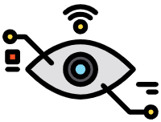
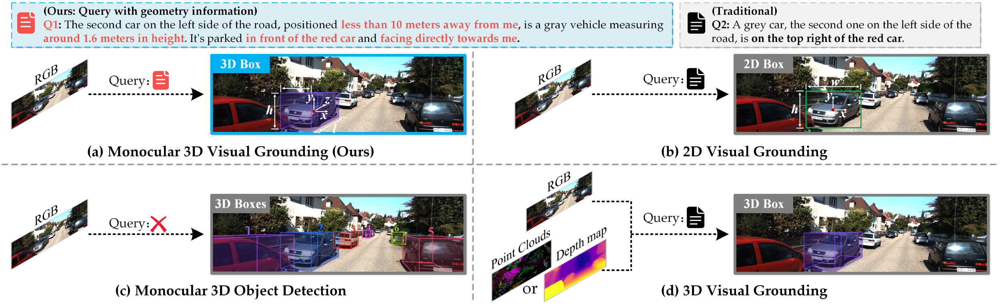
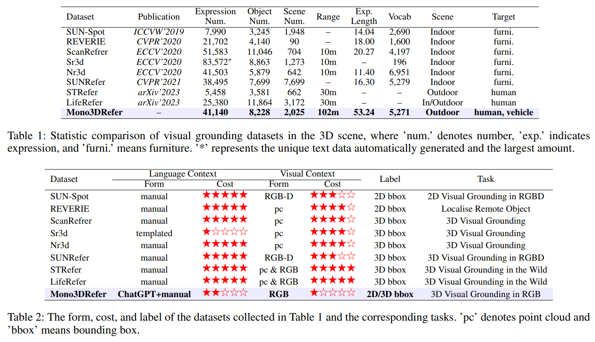
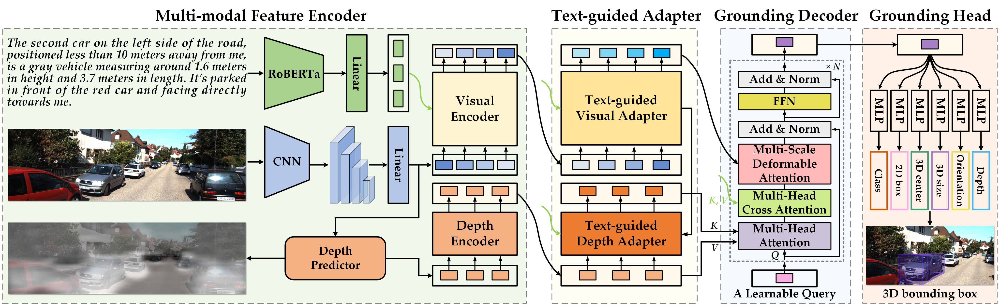
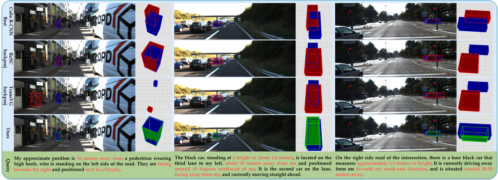
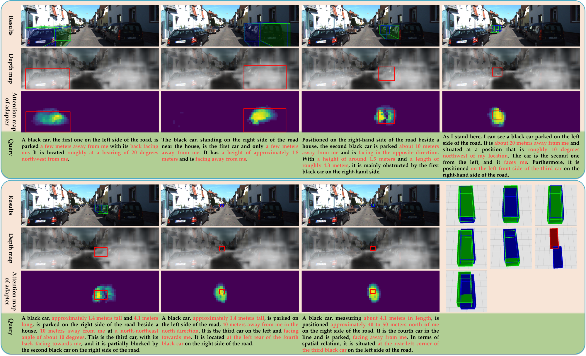
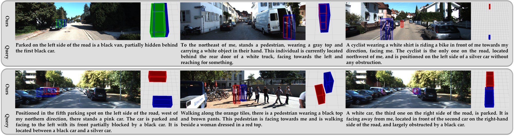
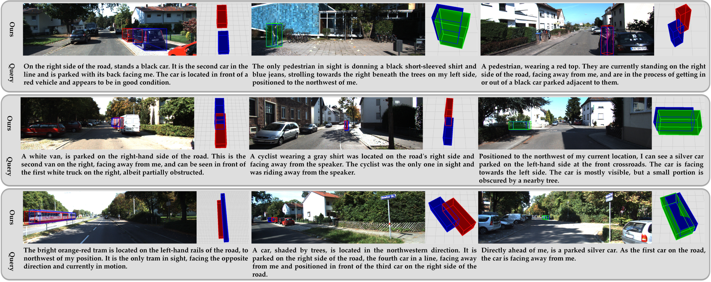
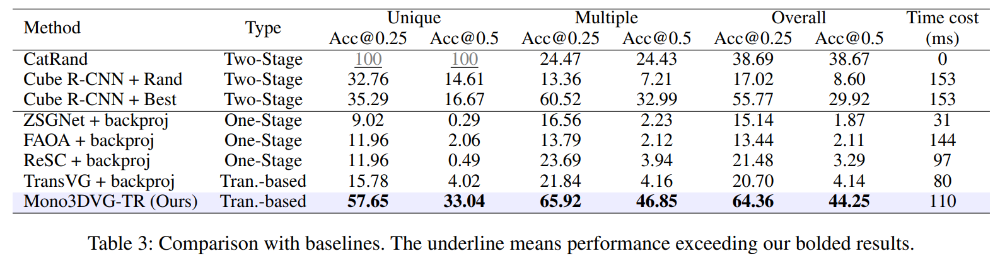

#  Mono3DVG: 3D Visual Grounding in Monocular Images
<p align="center">
    
</p>

##### Author: Yang Zhan, Yuan Yuan, Zhitong Xiong 
This is the official repository for paper **"Mono3DVG: 3D Visual Grounding in Monocular Images"**. [[AAAI paper](https://doi.org/10.1609/aaai.v38i7.28525)]     [[ArXiv paper](https://arxiv.org/pdf/2312.08022.pdf)]    [[AAAI Video/Poster](https://ojs.aaai.org/index.php/AAAI/article/view/28525/29024)]

The paper has been accepted by **AAAI 2024** 🎉.

**School of Artificial Intelligence, OPtics, and ElectroNics (iOPEN), Northwestern Polytechnical University**
## Please share a <font color='orange'>STAR ⭐</font> if this project does help


## 📢 Latest Updates
- **Dec-09-2023**: Mono3DVG paper is accepted by AAAI2024. 🔥🔥
- **Dec-29-2023**: Mono3DRefer dataset is released. 🔥🔥
- **Mar-13-2024**: Mono3DVG-TR codebase and checkpoint are released. 🔥🔥
- 📦 Components for the result visualization of Mono3DVG coming soon! 🚀
---

## 💬 Mono3DVG: 3D Visual Grounding in Monocular Images
We introduce a novel task of 3D visual grounding in monocular RGB images using descriptions with appearance and geometry information, termed Mono3DVG.
Mono3DVG aims to localize the true 3D extent of referred objects in an image using language descriptions with geometry information.
<div align="center">
  
</div>

## 🌋 Dataset
Download our Mono3DRefer dataset. We build the first dataset for Mono3DVG, termed Mono3DRefer, which can be downloaded from our [Google Drive](https://drive.google.com/drive/folders/1ICBv0SRbRIUnl_z8DVuH8lz7KQt580EI?usp=drive_link). The download link is available below:
```
https://drive.google.com/drive/folders/1ICBv0SRbRIUnl_z8DVuH8lz7KQt580EI?usp=drive_link
```

<div align="center">
  
</div>


##  Mono3DVG-TR: Architecture

Mono3DVG-TR is the **first end-to-end transformer-based network** for monocular 3D visual grounding. 
<div align="center">
  
</div>


## 📦 Mono3DVG-TR Codebase
### 1. Environment and Installation
You can follow the environment of [MonoDETR](https://github.com/ZrrSkywalker/MonoDETR).

#### 1.1 Clone this project and create a conda environment: python>=3.8, our version of python == 3.10.8

#### 1.2 Install pytorch and torchvision matching your CUDA version: torch >= 1.9.0, our version of torch == 1.13.1

#### 1.3 Install requirements and compile the **Deformable DETR and Attention**.
```
    pip install -r requirements.txt

    cd lib/models/mono3dvg/ops/
    bash make.sh
    
    cd ../../../..
```
#### 1.4 Download [Mono3DRefer](https://drive.google.com/drive/folders/1ICBv0SRbRIUnl_z8DVuH8lz7KQt580EI?usp=drive_link) datasets and prepare the **directory structure** as:

```
    │Mono3DVG/
    ├──Mono3DRefer/
    │   ├──images/
    │   │   ├──000000.png
    │   │   ├──...
    │   ├──calib/
    │   │   ├──000000.txt
    │   │   ├──...
    │   ├──Mono3DRefer_train_image.txt
    │   ├──Mono3DRefer_val_image.txt
    │   ├──Mono3DRefer_test_image.txt
    │   ├──Mono3DRefer.json
    │   ├──test_instanceID_split.json
    ├──configs
    │   ├──mono3dvg.yaml
    │   ├──checkpoint_best_MonoDETR.pth
    ├──lib
    │   ├──datasets/
    │   │   ├──...
    │   ├──helpers/
    │   │   ├──...
    │   ├──losses/
    │   │   ├──...
    │   ├──models/
    │   │   ├──...
    ├──roberta-base
    │   ├──...
    ├──utils
    │   ├──...
    ├──outputs    #  save_path
    │   ├──mono3dvg
    │   │   ├──...
    ├──test.py
    ├──train.py
```
    
You can also change the dataset path at "root_dir" in `configs/mono3dvg.yaml`.

You can also change the save path at "save_path" in `configs/mono3dvg.yaml`.

#### 1.5 Download pre-trained model and checkpoint

You **must** download the Pre-trained model of **RoBERTa** and **MonoDETR**.

You can download the checkpoint we provide to evaluate the Mono3DVG-TR model.
<table>
    <tr>
        <td div align="center">Models</td>
        <td div align="center">Links</td>  
        <td div align="center">File Path</td>  
        <td div align="center">File Name</td>  
    </tr>
    <tr>
        <td div align="center">RoBERTa</td> 
        <td div align="center"><a href="https://drive.google.com/file/d/1b7sOQyPmqyUMWoYZ8Vz49MRA7_-pjCpa/view?usp=drive_link">model</a></td>
        <td div align="center">`roberta-base\`</td>
        <td div align="center">`pytorch_model.bin`</td>
    </tr> 
    <tr>
        <td div align="center">Pre-trained model (MonoDETR)</td>
        <td div align="center"><a href="https://drive.google.com/file/d/1C3CCiaKHA8PImPyJyoQ9u9nIhD5ieRFJ/view?usp=sharing">model</a></td>
        <td div align="center">`configs\`</td>
        <td div align="center">`checkpoint_best_MonoDETR.pth`</td>
    </tr>  
    <tr>
        <td div align="center">Best checkpoint (Mono3DVG-TR)</td> 
        <td div align="center"><a href="https://drive.google.com/file/d/17MzREl1duTEF5E7_dVuwINkuHVCItS5V/view?usp=drive_link">model</a></td>
        <td div align="center">`outputs\mono3dvg\`</td>
        <td div align="center">`checkpoint_best.pth`</td>
    </tr> 
</table>


### 2. Get Started

#### (1). Train

You can modify the settings of GPU, models and training in `configs/mono3dvg.yaml`
```
    CUDA_VISIBLE_DEVICES=1 python train.py
```

#### (2). Test

The best checkpoint will be evaluated as default.
You can change it at "pretrain_model: 'checkpoint_best.pth'" in `configs/mono3dvg.yaml`:
```
    CUDA_VISIBLE_DEVICES=1 python test.py
```


## 👁️ Visualization

### 1. Qualitative results from baseline methods and our Mono3DVG-TR.

<div align="center">
  
</div>
Fig.1 Blue, green, and red boxes denote the ground truth, prediction with IoU higher than 0.5, and prediction with IoU lower than 0.5, respectively.

### 2. Qualitative results of our Mono3DVG-TR.
<div align="center">
  
</div>
Fig.2 Visualization of ’000152.png’ image’s localization results, the depth predictor’s depth maps, and the text-guided
adapter’s attention score maps for our Mono3DVG-TR.

### 3. Qualitative results in the ’unique’(top) and ’multiple’(bottom) subsets.
<div align="center">
  
</div>
<div align="center">
  
</div>
Fig.3 The gray block is the traditional query without specific geometry information.

### 4. Qualitative results in the ’near’, ’medium’, and ’far’ subsets.
<div align="center">
  
</div>
<div align="center">
  
</div>
Fig.4 The gray block is the traditional query without specific geometry information.

### 5. Qualitative results in the ’easy’, ’moderate’, and ’hard’ subsets.
<div align="center">
  
</div>
<div align="center">
  
</div>
Fig.5 The gray block is the traditional query without specific geometry information.


## 🔍 Results

### 1. Comparison with baselines.

<div align="center">
  
</div>

### 2. Results for ’near’-’medium’-’far’ subsets and ’easy’-’moderate’-’hard’ subsets.
<div align="center">
  
</div>


## 📜 Citation
```bibtex
@inproceedings{zhan2024mono3dvg,
  title={Mono3DVG: 3D Visual Grounding in Monocular Images},
  author={Zhan, Yang and Yuan, Yuan and Xiong, Zhitong},
  booktitle={Proceedings of the AAAI Conference on Artificial Intelligence},
  volume={38},
  number={7},
  pages={6988--6996},
  year={2024}
}
```

## 🙏 Acknowledgement
Our code is based on (ICCV 2023)[MonoDETR](https://github.com/ZrrSkywalker/MonoDETR). We sincerely appreciate their contributions and authors for releasing source codes. I would like to thank Xiong zhitong and Yuan yuan for helping the manuscript. I also thank the School of Artificial Intelligence, OPtics, and ElectroNics (iOPEN), Northwestern Polytechnical University for supporting this work.

## 🤖 Contact
If you have any questions about this project, please feel free to contact zhanyangnwpu@gmail.com.
