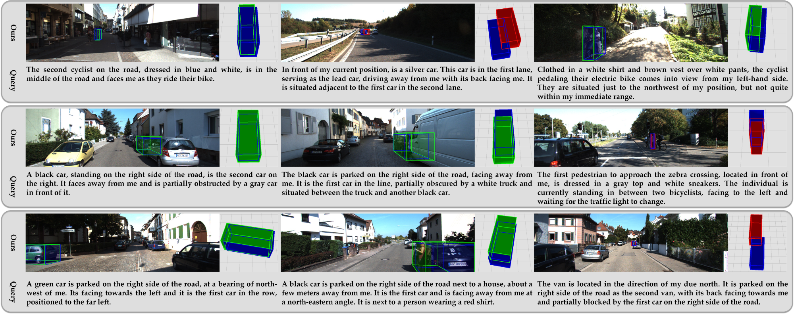
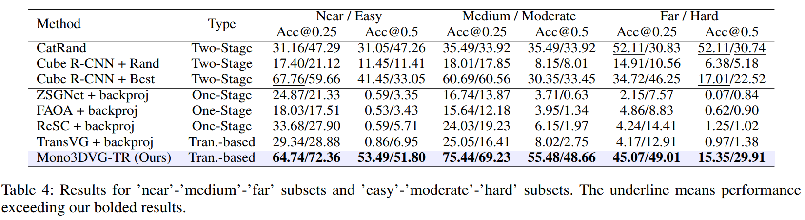

#  Mono3DVG: 3D Visual Grounding in Monocular Images
<p align="center">
    
</p>

##### Author: Yang Zhan
This is the official repository for paper **"Mono3DVG: 3D Visual Grounding in Monocular Images"**.

## Please share a <font color='orange'>STAR ⭐</font> if this project does help


## 📢 Latest Updates
- **Dec-09-2023**: Mono3DVG paper is accepted by AAAI2024. 🔥🔥
- 📦 Code, models, and datasets coming soon! 🚀
---

## 💬 Mono3DVG: 3D Visual Grounding in Monocular Images
introduction


##  Mono3DVG-TR: Architecture

Mono3DVG-TR is the **first end-to-end transformer-based network** for monocular 3D visual grounding. 
<div align="center">
  
</div>


## 👁️ Visualization

### 1. Qualitative results from baseline methods and our Mono3DVG-TR.

<div align="center">
  
</div>
Fig.1 Blue, green, and red boxes denote the ground truth, prediction with IoU higher than 0.5, and prediction with IoU lower than 0.5, respectively.

### 2. Qualitative results of our Mono3DVG-TR.
<div align="center">
  
</div>
Fig.2 Visualization of ’000152.png’ image’s localization results, the depth predictor’s depth maps, and the text-guided
adapter’s attention score maps for our Mono3DVG-TR.

### 3. Qualitative results in the ’unique’(top) and ’multiple’(bottom) subsets.
<div align="center">
  
</div>
<div align="center">
  
</div>
Fig.3 The gray block is the traditional query without specific geometry information.

### 4. Qualitative results in the ’near’, ’medium’, and ’far’ subsets.
<div align="center">
  
</div>
<div align="center">
  
</div>
Fig.4 The gray block is the traditional query without specific geometry information.

### 5. Qualitative results in the ’easy’, ’moderate’, and ’hard’ subsets.
<div align="center">
  
</div>
<div align="center">
  
</div>
Fig.5 The gray block is the traditional query without specific geometry information.


## 🔍 Results

### 1. Comparison with baselines.

<div align="center">
  
</div>

### 2. Results for ’near’-’medium’-’far’ subsets and ’easy’-’moderate’-’hard’ subsets.
<div align="center">
  
</div>


## 📜 Citation
```bibtex
@misc{*,
      title={}, 
      author={},
      year={2023},
      archivePrefix={arXiv}
}  
```

## 🙏 Acknowledgement
Our code is based on (ICCV 2023)[MonoDETR](https://github.com/ZrrSkywalker/MonoDETR). We sincerely appreciate their contributions and authors for releasing source codes. I would like to thank Xiong zhitong and Yuan yuan for helping the manuscript. I also thank the School of Artificial Intelligence, OPtics, and ElectroNics (iOPEN), Northwestern Polytechnical University for supporting this work.

## 🤖 Contact
If you have any questions about this project, please feel free to contact zhanyangnwpu@gmail.com.
